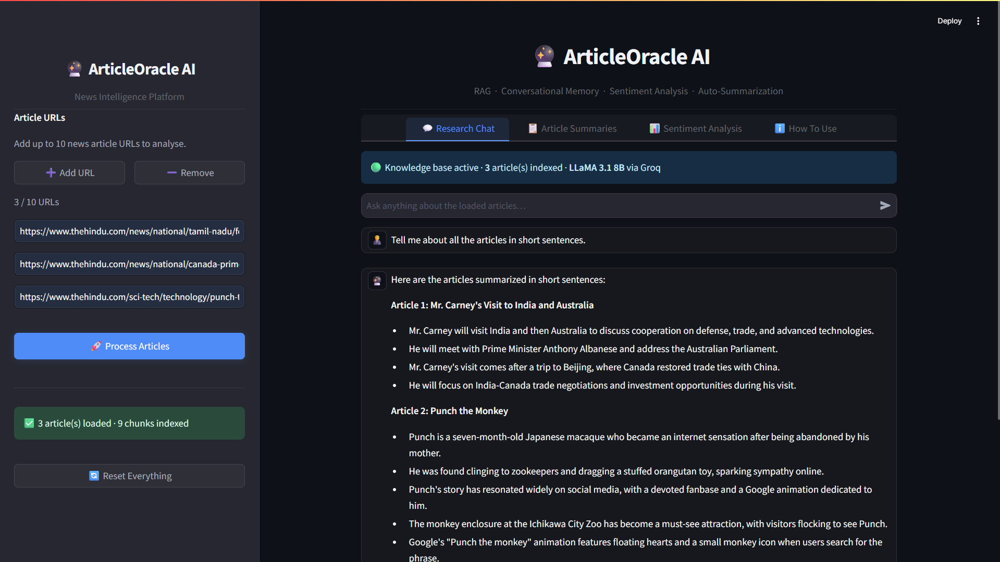
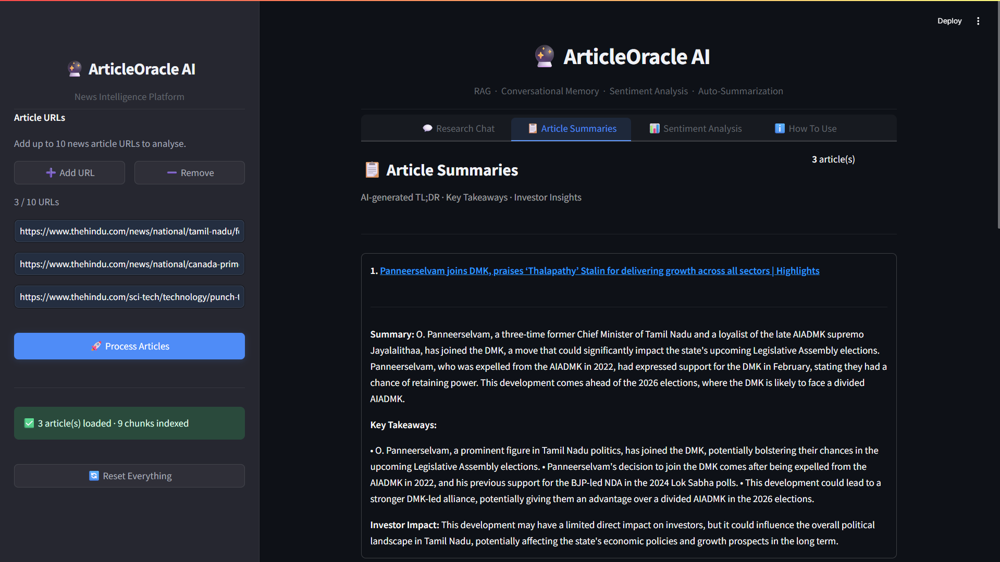
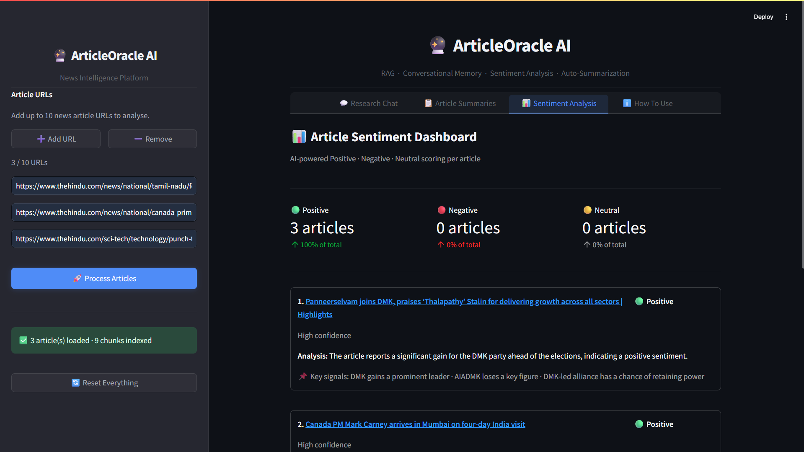

<div align="center">


<p><b>Ask questions. Get cited answers. Understand news at a deeper level.</b></p>

</div>


<p align="center">
  <a href="https://python.org"></a>
  <a href="https://streamlit.io"></a>
  <a href="https://langchain.com"></a>
  <a href="https://groq.com"></a>
  <a href="https://github.com/facebookresearch/faiss"></a>
  <a href="https://opensource.org/licenses/MIT"></a>
</p>

<p align="center">
  <i>Paste any news article URL → Ask anything → Get instant, cited, AI-powered answers.</i>
</p>

</div>

---

## 🌟 What is ArticleOracle AI?

**ArticleOracle AI** is an intelligent research assistant built on a **Retrieval-Augmented Generation (RAG)** pipeline. Drop in up to 10 news article URLs, and the system instantly builds a private knowledge base — letting you chat with your articles, extract summaries, and analyze sentiment, all in a sleek dark-mode interface.

> Unlike generic chatbots, ArticleOracle **only answers from the content you provide** — keeping every response grounded, accurate, and verifiable with source citations.

---
## 📸 Results

<div align="center">

<table>
  <tr>
    <td align="center"><br/><b>💬 Chat Interface</b></td>
    <td align="center"><br/><b>📋 Article Summaries</b></td>
  </tr>
  <tr>
    <td align="center" colspan="2"><br/><b>📊 Sentiment Dashboard</b></td>
  </tr>
</table>

</div>

---

## ✨ Features at a Glance

<table>
  <tr>
    <td>🔗 <b>Dynamic URL Input</b></td>
    <td>Add or remove up to 10 article URLs on the fly from the sidebar</td>
  </tr>
  <tr>
    <td>🧠 <b>RAG Pipeline</b></td>
    <td>FAISS vector store + HuggingFace embeddings + LLaMA 3.1 via Groq</td>
  </tr>
  <tr>
    <td>💬 <b>Conversational Memory</b></td>
    <td>Follow-up questions work naturally — AI remembers your last 6 turns</td>
  </tr>
  <tr>
    <td>📌 <b>Source Citations</b></td>
    <td>Every answer is backed by the exact article chunk it came from</td>
  </tr>
  <tr>
    <td>📋 <b>AI Summaries</b></td>
    <td>TL;DR + bullet takeaways + impact notes per article</td>
  </tr>
  <tr>
    <td>📊 <b>Sentiment Analysis</b></td>
    <td>Positive / Negative / Neutral scoring with confidence and key signals</td>
  </tr>
  <tr>
    <td>🎨 <b>Premium Dark UI</b></td>
    <td>Multi-tab Streamlit app with Inter font, custom CSS, and gradient branding</td>
  </tr>
  <tr>
    <td>⚡ <b>Ultra-Fast Inference</b></td>
    <td>Groq's LPU delivers ~500 tokens/sec — near-instant responses</td>
  </tr>
</table>

---

## 🏗️ Architecture

```
User Input (URLs)
        │
        ▼
┌──────────────────────┐
│   Article Loader     │  ←  newspaper3k + BeautifulSoup (with fallback)
└──────────┬───────────┘
           │  Raw text + metadata
           ▼
┌──────────────────────┐
│   Text Chunker       │  ←  RecursiveCharacterTextSplitter
│                      │      chunk=800, overlap=150
└──────────┬───────────┘
           │  Document chunks
           ▼
┌──────────────────────┐
│   HuggingFace        │  ←  all-MiniLM-L6-v2
│   Embeddings         │      local · free · ~90MB
└──────────┬───────────┘
           │  Dense vectors
           ▼
┌──────────────────────┐
│   FAISS Index        │  ←  Fast similarity search
└──────────┬───────────┘
           │  Top-k relevant chunks
           ▼
┌──────────────────────────────────────┐
│   ConversationalRetrievalChain       │  ←  LangChain v0.2
│   + ConversationBufferWindowMemory   │      Remembers last 6 turns
└──────────┬───────────────────────────┘
           │
           ▼
┌──────────────────────┐
│   ChatGroq           │  ←  LLaMA 3.1 8B Instant
└──────────┬───────────┘
           │
           ▼
    Answer + Source Citations
```

---

## 📁 Project Structure

```
ArticleOracle-AI/
│
├── app.py                    ←  Main Streamlit entry point
├── requirements.txt          ←  All dependencies
├── .env                      ←  API keys (never committed to Git)
│
├── backend/
│   ├── __init__.py
│   ├── loader.py             ←  URL fetching & text chunking
│   ├── vectorstore.py        ←  FAISS build & HuggingFace embeddings
│   ├── rag_chain.py          ←  RAG chain with conversation memory
│   ├── summarizer.py         ←  Article TL;DR generation
│   └── sentiment.py         ←  Positive / Negative / Neutral classification
│
└── ui/
    ├── __init__.py
    ├── sidebar.py            ←  Dynamic URL inputs & status panel
    ├── chat_tab.py           ←  Chat bubbles + source citations
    ├── summary_tab.py        ←  Summary cards per article
    └── sentiment_tab.py      ←  Sentiment dashboard
```

---

## ⚙️ Setup & Installation

### Prerequisites

- Python **3.9+**
- A free Groq API key → [console.groq.com](https://console.groq.com)

### 1. Clone the Repository

```bash
git clone https://github.com/Yashpurbhe123/ArticleOracle.AI.git
cd ArticleOracle.AI
```

### 2. Install Dependencies

```bash
pip install -r requirements.txt
```

> **Note:** On first run, HuggingFace downloads the embedding model (~90MB). This is cached automatically — subsequent runs are instant.

### 3. Configure Environment Variables

Create a `.env` file in the project root:

```env
GROQ_API_KEY=your_groq_api_key_here
```

### 4. Run the Application

```bash
streamlit run app.py
```

The app opens automatically at **`http://localhost:8501`** 🚀

---

## 🖥️ How to Use

```
Step 1  →  Paste 1–10 news article URLs in the sidebar
           (Reuters, TechCrunch, BBC, Economic Times, etc.)

Step 2  →  Click 🚀 Process Articles
           The system fetches, embeds, and indexes everything in seconds.

Step 3  →  Go to 💬 Research Chat and ask anything:
           "What is the target price for Tata Motors?"
           "Summarize the key risks mentioned across articles."
           "What do analysts say about growth prospects?"

Step 4  →  Visit 📋 Article Summaries
           AI-generated TL;DRs with bullet takeaways per article.

Step 5  →  Visit 📊 Sentiment Analysis
           Per-article Positive / Negative / Neutral scoring with signals.
```

---

## 🛠️ Tech Stack

| Layer | Technology |
|---|---|
| **LLM** | LLaMA 3.1 8B Instant (via Groq API) |
| **LLM Framework** | LangChain v0.2 — ConversationalRetrievalChain |
| **Embeddings** | HuggingFace `sentence-transformers/all-MiniLM-L6-v2` |
| **Vector Store** | FAISS (Facebook AI Similarity Search) |
| **Web Scraping** | newspaper3k + BeautifulSoup4 |
| **Frontend** | Streamlit 1.37 with custom dark-mode CSS |
| **Config** | python-dotenv |

---

## 🔑 Environment Variables

| Variable | Required | Description |
|---|---|---|
| `GROQ_API_KEY` | ✅ Yes | Your Groq API key for LLaMA 3.1 inference |

---

## 📄 License

This project is licensed under the **MIT License** — see the [LICENSE](LICENSE) file for details.

---

## 🙏 Acknowledgements

Special thanks to the open-source tools that power ArticleOracle AI:

- [**Groq**](https://groq.com) — ultra-fast LLM inference via LPU hardware
- [**LangChain**](https://langchain.com) — the backbone LLM application framework
- [**HuggingFace**](https://huggingface.co) — open-source sentence embeddings
- [**FAISS**](https://github.com/facebookresearch/faiss) — efficient vector similarity search by Meta AI
- [**Streamlit**](https://streamlit.io) — rapid ML app development

---

<div align="center">

**Built with ❤️ using LangChain · Groq · FAISS · Streamlit**

⭐ *If you found this useful, consider starring the repo!* ⭐

</div>

